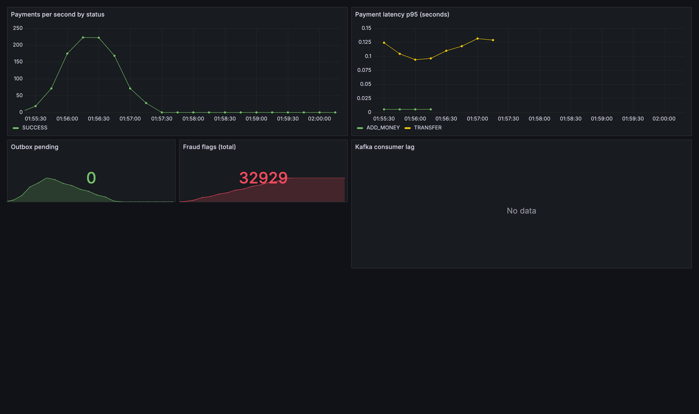
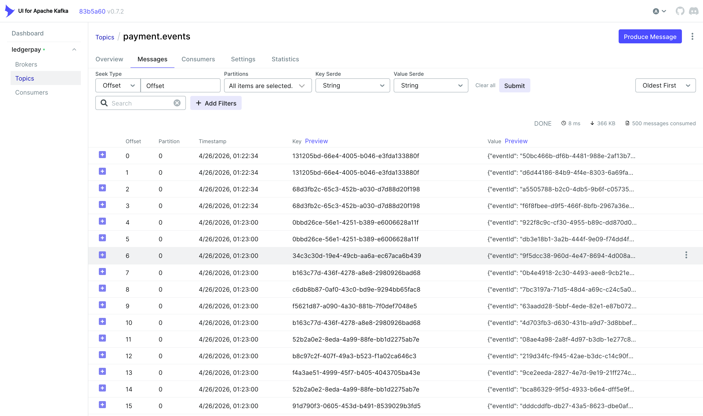
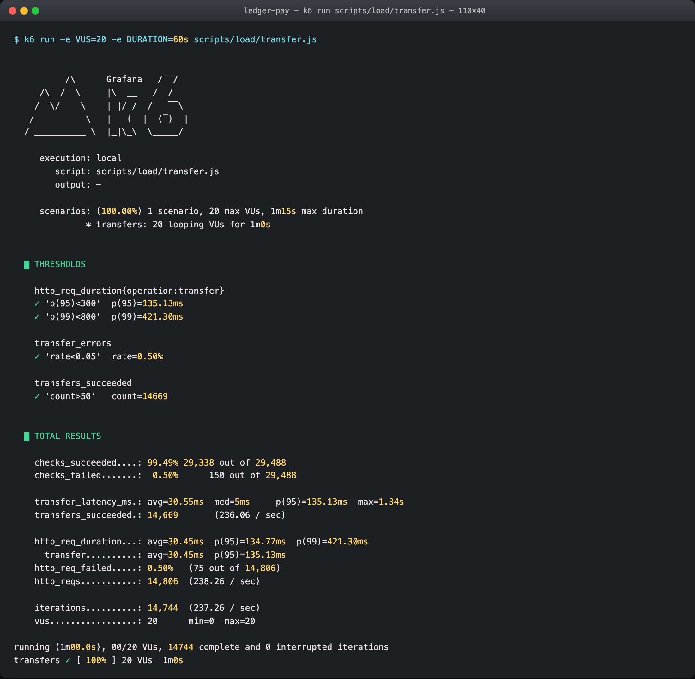
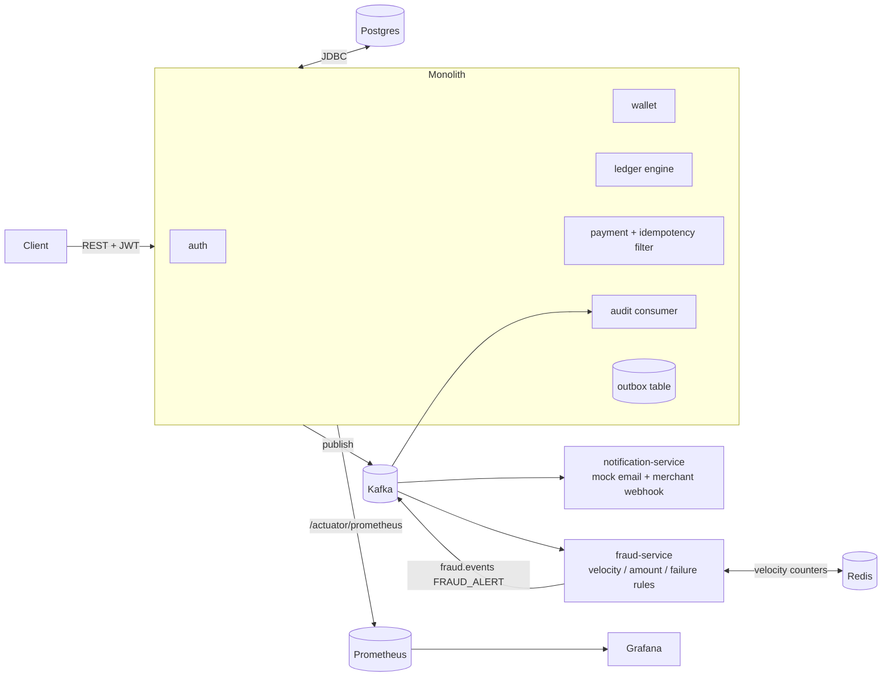

# LedgerPay

[](https://github.com/sarthakj1904/ledgerpay/actions/workflows/ci.yml)
[](https://adoptium.net/temurin/releases/?version=21)
[](https://spring.io/projects/spring-boot)
[](#license)

A production-grade payment-infrastructure backend built as a hybrid **modular monolith + extracted services**, inspired by Stripe/Razorpay/PayPal. Implements a correct double-entry ledger, idempotent APIs, transactional outbox + Kafka, fraud detection, and end-to-end observability.

- **Stack:** Java 21, Spring Boot 3, Spring Security (JWT), Spring Data JPA, PostgreSQL 16, Apache Kafka, Redis (fraud service), Docker, Prometheus, Grafana.
- **Architecture:** one Spring Boot monolith (`monolith/`) containing bounded contexts (auth, wallet, ledger, payment, audit), plus two independently-deployable services (`services/notification-service`, `services/fraud-service`) that demonstrate microservice extraction over Kafka.

---

## Problem statement

Payment platforms must move money with three hard guarantees at the same time:

1. **Correctness** — money is never created or destroyed. Every transaction produces balanced debits and credits that reconcile to zero.
2. **Idempotency** — retried or replayed requests never double-charge a user.
3. **Durability + observability** — every state change is auditable, replayable, and visible in metrics.

LedgerPay is a reference implementation of these guarantees under realistic failure modes: optimistic-lock contention, consumer crashes, and flaky downstream webhooks.

---

## What it looks like running

End-to-end metrics during a 60-second k6 hot-spot load test (20 VUs hammering a single
contended sink wallet — see [the load test script](scripts/load/transfer.js)):



Every payment emits a fully-formed envelope onto Kafka via the transactional outbox. Browsing
`payment.events` in Kafka UI shows them landing in real time:



The k6 run that produced the metrics above:



---

## Architecture



### Key design decisions

| Decision | Why |
|---|---|
| **Double-entry ledger** (immutable `ledger_entries`) | `sum(debits) == sum(credits)` per transaction, enforced in code and by append-only DB triggers. Makes reconciliation a two-line SQL query. |
| **Money in `BIGINT` minor units** | Avoids floating-point drift on aggregation. All totals are exact. |
| **Transactional outbox** | Business change + "intent to publish" commit atomically; a separate polling job drains the outbox to Kafka with `FOR UPDATE SKIP LOCKED` for horizontal scale and a DLQ for poison events. |
| **`Idempotency-Key` filter + DB UNIQUE** | Two layers of defence: an HTTP filter replays the cached response body; the `transactions.idempotency_key UNIQUE` constraint is the last line of defence against concurrent duplicates. |
| **Optimistic locking + retry** | Wallet rows use JPA `@Version`. On `OptimisticLockingFailureException` the payment posting retries up to 3 times with a small backoff — no row-level locks, no deadlocks. |
| **`SYSTEM` suspense wallet** | Lets us keep `ADD_MONEY` double-entry (debit suspense / credit user). User and merchant wallets are guarded from negatives; the suspense wallet is explicitly allowed to go negative (it represents the external world). |
| **Hybrid extraction** | Core flows live in the monolith for fast iteration; fraud and notification are extracted processes to demonstrate service boundaries over Kafka. |

### Tradeoffs

- **Optimistic vs pessimistic locking** — optimistic is higher-throughput in the common case; under heavy same-wallet contention the retry loop will bound it. Pessimistic (`SELECT ... FOR UPDATE`) would be preferable if a single wallet is a persistent hotspot.
- **Outbox vs CDC** — Debezium would remove the polling thread but doubles ops footprint. The outbox polling approach is simpler and sufficient at sub-10k-tx/s.
- **Mock KYC / webhook / email** — explicitly stubbed; the interfaces are real (merchant webhooks are HMAC-signed, retried with exponential backoff, DLQ'd).

---

## Repository layout

```
ledger-pay/
  pom.xml                     # parent aggregator
  docker-compose.yml          # postgres, redis, kafka, kafka-ui, prometheus, grafana + 3 app containers
  monolith/                   # Spring Boot monolith
    src/main/java/com/ledgerpay/
      common/                 # shared kernel: security, idempotency, outbox, kafka, metrics, exceptions
      auth/                   # users, merchants, JWT, RBAC
      wallet/                 # wallet lifecycle + ownership checks
      ledger/                 # immutable ledger + double-entry engine
      payment/                # add-money, transfer, merchant-pay, refund APIs
      audit/                  # audit consumer + fraud-alert consumer
    src/main/resources/db/migration/V1__init.sql
    src/test/java/...         # unit + Testcontainers integration + concurrency tests
  services/
    notification-service/     # Kafka consumer — mock email + HMAC-signed webhook with retry + DLQ
    fraud-service/            # Kafka consumer — velocity / amount-spike / failure / IP rules → FRAUD_ALERT
  infra/
    prometheus/prometheus.yml
    grafana/dashboards/ledgerpay.json
    postman/LedgerPay.postman_collection.json
```

---

## Database schema

All monetary amounts are `BIGINT` minor units. All IDs are `UUID`. Mutable rows have `version` for optimistic locking. Cross-cutting migration: [`V1__init.sql`](monolith/src/main/resources/db/migration/V1__init.sql).

| Table | Purpose | Notable columns / constraints |
|---|---|---|
| `users` | Account identity | `email UNIQUE`, `role ∈ {USER,MERCHANT,ADMIN}`, `kyc_status`, `@Version` |
| `merchants` | Merchant profile | `api_key UNIQUE`, `webhook_url`, `webhook_secret` |
| `wallets` | Balance of record | `@Version`, non-negativity enforced (except SYSTEM) |
| `transactions` | Intent + status | `idempotency_key UNIQUE`, `type`, `status`, `parent_txn_id` |
| `ledger_entries` | Immutable double-entry log | append-only; DB trigger rejects UPDATE/DELETE |
| `idempotency_keys` | Cached responses | `request_hash` (SHA-256) + cached `response_body` |
| `fraud_flags` | Fraud rule triggers | `rule_name`, `severity`, `details jsonb` |
| `audit_logs` | Every business event | JSONB `details`, indexed by actor + time |
| `outbox` | Publish-intent log | `status`, `retry_count`, `last_error` |

Indexes are placed on every expected query shape (see the migration for the complete list).

---

## API reference (v1)

All responses use `application/json`; errors use RFC 7807 (`application/problem+json`). All payment write endpoints require an `Idempotency-Key` header (any string up to 128 chars).

### Auth
| Method | Path | Body | Auth |
|---|---|---|---|
| POST | `/api/v1/auth/register` | `{email, password, role, businessName?, webhookUrl?}` | — |
| POST | `/api/v1/auth/login` | `{email, password}` | — |
| GET  | `/api/v1/auth/me/merchant` | — | Bearer JWT |

### Wallets
| Method | Path | Body | Auth |
|---|---|---|---|
| POST | `/api/v1/wallets` | `{currency?}` | Bearer JWT |
| GET  | `/api/v1/wallets/{id}` | — | Bearer JWT (owner) |
| GET  | `/api/v1/wallets/{id}/balance` | — | Bearer JWT (owner) |
| POST | `/api/v1/wallets/{id}/freeze` | — | ADMIN |
| POST | `/api/v1/wallets/{id}/unfreeze` | — | ADMIN |

### Payments (all require `Idempotency-Key` header)
| Method | Path | Body |
|---|---|---|
| POST | `/api/v1/payments/add-money` | `{walletId, amountMinor, currency?}` |
| POST | `/api/v1/payments/transfer` | `{fromWalletId, toWalletId, amountMinor}` |
| POST | `/api/v1/payments/merchant-pay` | `{fromWalletId, merchantId, amountMinor}` |
| POST | `/api/v1/payments/refund` | `{transactionId, amountMinor}` |

### Transactions
| Method | Path | Query |
|---|---|---|
| GET | `/api/v1/transactions/{id}` | — |
| GET | `/api/v1/transactions` | `walletId`, `page`, `size` |

### Admin / Reconciliation (ROLE_ADMIN)
| Method | Path | Description |
|---|---|---|
| POST | `/api/v1/admin/reconciliation/run` | Run an integrity-check pass synchronously and return the report |
| GET  | `/api/v1/admin/reconciliation` | List reports (newest first) |
| GET  | `/api/v1/admin/reconciliation/{id}` | Full report incl. `mismatches` JSON |

A bootstrap admin is auto-created on first start with credentials configurable via
`ledgerpay.bootstrap.admin.email` / `ledgerpay.bootstrap.admin.password` (defaults
`admin@ledgerpay.local` / `admin12345`). Rotate these in any non-dev deployment.

The scheduled reconciliation runs daily at `02:00` server-time (`ledgerpay.reconciliation.cron`,
Spring `@Scheduled` cron expression). It verifies two invariants:
1. Global `sum(debits) = sum(credits)` per currency.
2. For every non-`SYSTEM` wallet, `wallets.balance_minor = sum(credits) - sum(debits)` from the
   immutable ledger.

A ready-to-import Postman collection is at [`infra/postman/LedgerPay.postman_collection.json`](infra/postman/LedgerPay.postman_collection.json).

---

## Running it

### Prerequisites
- **Java 21** (Temurin / Corretto)
- **Maven 3.9+**
- **Docker** + **Docker Compose v2**

### Quick start (Docker Compose)
```bash
docker compose up -d postgres kafka zookeeper redis kafka-ui prometheus grafana
mvn -DskipTests package
docker compose up -d monolith notification-service fraud-service
```

- Monolith REST API: <http://localhost:8080>
- Notification service: <http://localhost:8081>
- Fraud service: <http://localhost:8082>
- Kafka UI: <http://localhost:8085>
- Prometheus: <http://localhost:9090>
- Grafana: <http://localhost:3000> (admin / admin; dashboard **LedgerPay Overview** is auto-provisioned)

### Run the monolith locally
```bash
docker compose up -d postgres kafka zookeeper
mvn -pl monolith spring-boot:run
```

### Run tests
```bash
mvn verify
```

Testcontainers spins up throw-away Postgres + Kafka instances per test-class.

---

## Observability

- Every service exposes `/actuator/prometheus`. A [Grafana dashboard](infra/grafana/dashboards/ledgerpay.json) is auto-provisioned via `infra/grafana/provisioning/`.
- Custom metrics:
  - `ledgerpay_payment_total{type,status}` — counter per payment outcome
  - `ledgerpay_payment_latency_seconds_bucket{type}` — histogram for p50/p95/p99
  - `ledgerpay_outbox_pending` — gauge over `outbox.status = PENDING`
  - `ledgerpay_fraud_flags_total{rule}` — counter of fraud triggers
- Kafka consumer lag is exposed via Micrometer's Kafka binder (`kafka_consumer_fetch_manager_records_lag`).

---

## Reliability playbook

| Concern | Mechanism |
|---|---|
| Duplicate payment on retry | `IdempotencyFilter` + cached response + `transactions.idempotency_key UNIQUE` |
| Lost publish on crash between DB commit and Kafka send | Transactional outbox + polling publisher |
| Poison event spinning the publisher | Retry counter + DLQ (`<topic>.DLQ`) after `max-retries` |
| Concurrent same-wallet updates | `@Version` + retry loop (3 attempts w/ backoff) |
| Horizontal publisher scale | `FOR UPDATE SKIP LOCKED` batches |
| Graceful shutdown | `server.shutdown=graceful`, manual-ack Kafka |
| Webhook flakiness (notification service) | Reactor `Retry.backoff` with jitter + DLQ |

---

## Performance (measured)

Apple Silicon (M-series) under Colima (4 CPU / 6 GB), Docker Engine 29, with the full stack
running in compose (Postgres + Kafka + Redis + 3 app containers + observability).

The k6 script at [`scripts/load/transfer.js`](scripts/load/transfer.js) is intentionally a
**hot-spot stress test**: 20 VUs, each with their own funded wallet, all transferring into one
shared sink wallet. This pegs the sink wallet's `@Version` optimistic lock and exercises the
`PaymentService` retry loop under continuous contention.

| Metric | Value |
|---|---:|
| Sustained successful transfers | **236 / sec** |
| Total HTTP throughput | 238 req/sec |
| Transfer p50 | 5 ms |
| Transfer p95 | 135 ms |
| Transfer p99 | 421 ms |
| Successful transfers in 60 s | 14,669 |
| Error rate (after retry exhaustion) | 0.50 % |

Reproduction:

```bash
docker compose up -d                                          # bring stack up
k6 run scripts/load/transfer.js                               # default 20 VUs / 30 s
k6 run -e VUS=50 -e DURATION=2m scripts/load/transfer.js      # heavier
```

Raising `ledgerpay.payment.max-optimistic-retries` (default `8`) trades higher tail latency for
lower error rate. Sharding the receiver across multiple wallets would yield dramatically lower
p95 because the hot-spot disappears; this test is intentionally pathological.

---

## Future work

The full backlog with design notes, scope estimates, and acceptance criteria lives in
[`ROADMAP.md`](ROADMAP.md). At a glance:

- **Reliability** — Resilience4j circuit breakers on webhooks, pessimistic-locking opt-in for
  hot-spot wallets, idempotency-key TTL cleanup, outbox poison-event admin endpoint.
- **Throttling** — Bucket4j rate limiting per API key, feature flags.
- **Money lifecycle** — Chargebacks/disputes, scheduled merchant payouts, multi-currency wallets.
- **Ops** — Real Kubernetes manifests, multi-region simulation, OpenTelemetry distributed tracing.
- **Frontend** — Next.js admin dashboard + merchant self-serve portal.

---

## Contributing / layout conventions

- One bounded context per top-level package (`auth`, `wallet`, `ledger`, `payment`, `audit`).
- Inside each context: `domain/` (entities + repositories), `service/` (business rules), `api/` (DTOs + controllers), `event/` (payloads).
- Transactional methods live in dedicated `*TxOperations` beans so the Spring proxy is always honoured.
- Domain exceptions extend `DomainException` and are translated by `GlobalExceptionHandler` to RFC-7807 responses.

---

## License

MIT.
